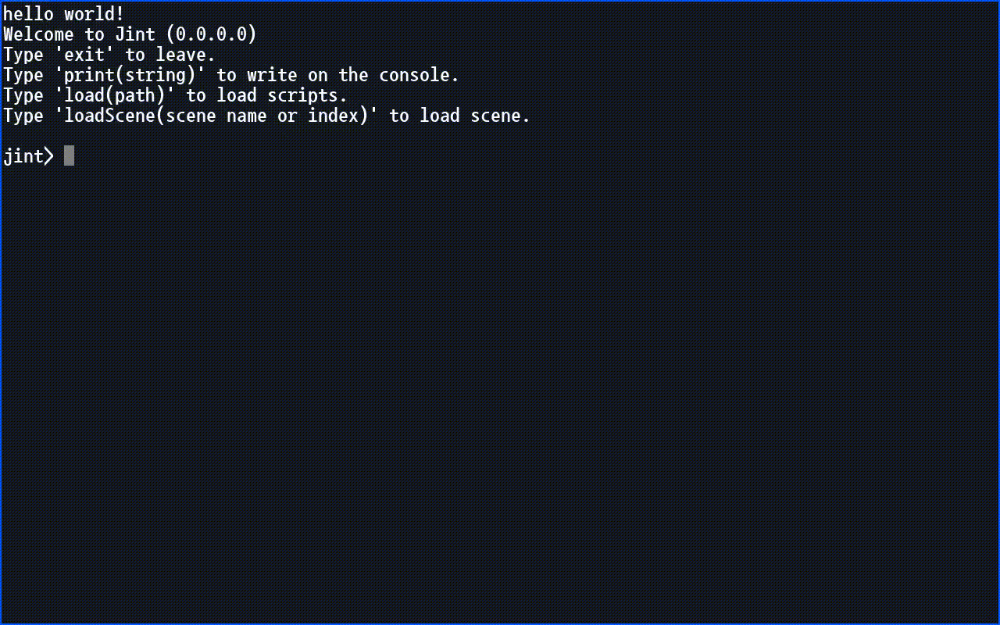

# Table of contents

[1.Summary](#summary)
[2.Unity Version](#unity-version)
[3.Features](#features)
[4.Example of use](#example-of-use)
[5.Example of Command Definition](#example-of-command-definition)
[6.Configuration](#configuration)
[7.Sliding controller](#sliding-controller)
[8.javascript](#javascript)

***

## /Summary

u-Terminal is like a terminal in Unix, a console in Windows, and a console window in FPS games.

Provides a REPL environment for receiving user input and outputting results.

***

## /Unity Version

2018.4.27f1 and later
2019.4.10f1 and later
2020.1.6f1 and later

***

## /Features

* Asynchronous command support
* Subcommand support
* Autocomplete command
* Automatically generate help
* Text color support
* Mobile support(ios, android)
* Various styles and palettes

***

## /Example of use

```
comp ls /GameObject
config audio.pause true
date --locale ko-KR --utc
obj ls / --recursive
exit
info productName
resolution --full
scene --list
version
```

***

## /Example of Command Definition

Base command definition

```cs
[CommandSummary("Exit the application.")]
public class ExitCommand : TerminalCommandBase
{
    public ExitCommand(ITerminal terminal)
        : base(terminal)
    {
    }

    [CommandPropertyRequired(DefaultValue = 0)]
    [CommandSummary("Specifies the exit code. The default is 0.")]
    public int ExitCode { get; set; }

    protected override void OnExecute()
    {
#if UNITY_EDITOR
        UnityEditor.EditorApplication.isPlaying = false;
#else
        UnityEngine.Application.Quit();
#endif
    }
}
```

Base usage


***

## /Configuration

Register field information to be used as configuration

```cs
public class TestConfiguration : MonoBehaviour
{
    [SerializeField]
    private float value = 0;
    [SerializeField]
    private ConfigurationSystem configSystem = null;

    private void Awake()
    {
        if (this.configSystem != null)
        {
            this.configSystem.AddConfig(new FieldConfiguration("test.value", this, nameof(value)) { DefaultValue = this.value });
        }
    }
}
```

How to use configurations in a terminal


***

## /Sliding controller

default key : ctrl + `


***

## /javascript

*javascript content is not included in the asset.*

The figure below is implemented using the [jint](https://github.com/sebastienros/jint) library.


