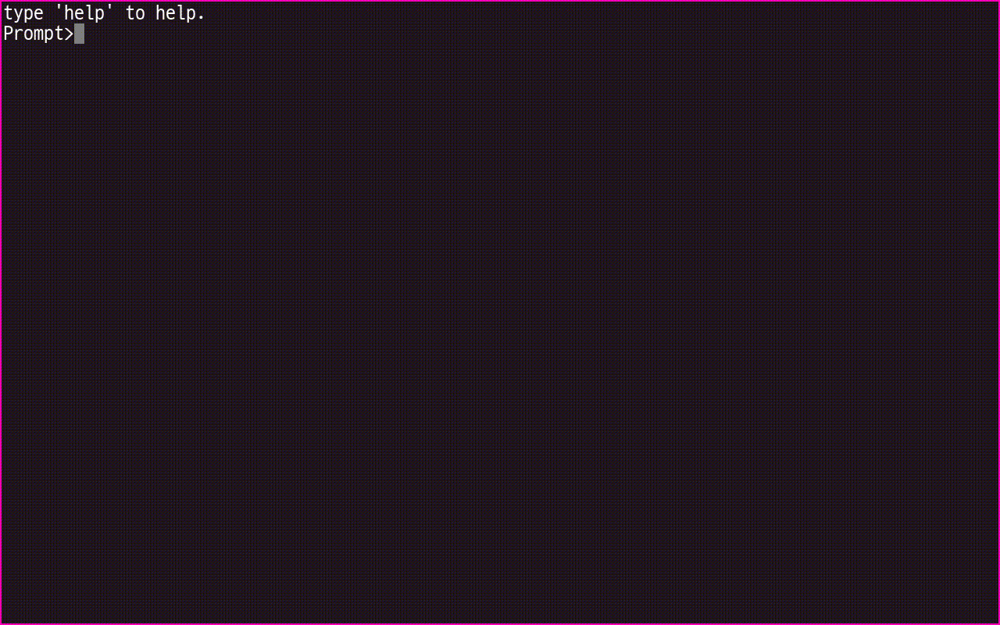

# 소개

u-Terminal 은 사용자의 입력을 받고 결과를 출력하는 REPL 환경을 제공합니다.

유닉스의 터미널, 윈도우의 콘솔, FPS 게임의 콘솔창 등의 환경을 유니티에서 사용하기 위해서 개발되었습니다.

* 유니티의 로그를 종류별로 출력하거나 특정 객체의 메소드를 호출할 수 있으며

특정 객체의 필드 및 속성등을 열람할 수 있으며 값을 설정할 수도 있습니다.

비동기 작업을 통해서 복잡한 작업을 수행할 수 있습니다.

이러한 작업들은 미리 정의된 명령어를 통해 수행할 수 있으며

직접 명령어를 정의할 수도 있습니다.

작성된 명령어는 간단한 설명을 추가하는 것만으로도 멋진 도움말이 자동으로 작성되므로

다른 개발자들에게 쉽게 사용법을 공유할 수 있습니다.

아래의 내용은 미리 정의된 명령어를 통해 실행할 수 있는 예제입니다.

{: width="700" height="438"}
{: width="700" height="438"}
{: width="700" height="438"}

```
comp ls /GameObject
config audio.pause true
date --locale ko-KR --utc
obj ls / --recursive
exit
info productName
resolution --full
scene --list
version
```

아래는 exit 명령어의 정의 내용입니다.

```cs
public class TestExitCommand : TerminalCommandBase
{
    public TestExitCommand(ITerminal terminal)
        : base(terminal)
    {
    }

    [CommandPropertyRequired(DefaultValue = 0)]
    public int ExitCode { get; set; }

    protected override void OnExecute()
    {
#if UNITY_EDITOR
        UnityEditor.EditorApplication.isPlaying = false;
#else
        UnityEngine.Application.Quit();
#endif
    }
}
```